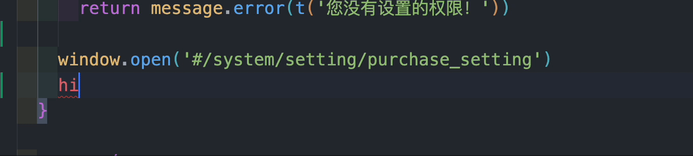
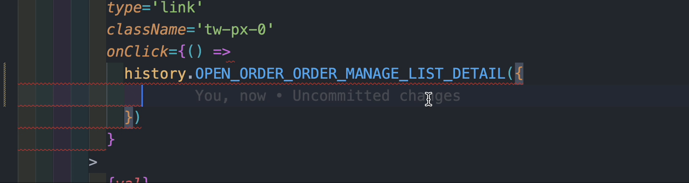

<p align="center">
<h1 align="center">generate-history-method-webpack-plugin</h1>
</p>

<div align="center">
  A webpack Plugin for automatically generating routing methods based on conventional routing

 [![NPM version][npm-image]][npm-url] ![NPM downloads][download-image]

![Test][test-badge]


[npm-image]: https://img.shields.io/npm/v/generate-history-method-webpack-plugin.svg?style=flat-square
[npm-url]: http://npmjs.org/package/generate-history-method-webpack-plugin


[download-image]: https://img.shields.io/npm/dm/generate-history-method-webpack-plugin.svg?style=flat-square


[test-badge]: https://github.com/baozouai/generate-history-method-webpack-plugin/actions/workflows/ci.yml/badge.svg


</div>

English | [中文](./README-zh_CN.md)

## 📦  Install

```sh
pnpm add generate-history-method-webpack-plugin -D
# or
yarn add generate-history-method-webpack-plugin -D
# or
npm i generate-history-method-webpack-plugin -D
```

make sure your dependencies have `qs`，otherwise please install

```sh
pnpm add qs -D
# or
yarn add qs -D
# or
npm i qs -D
```

Make sure to export default history under your project `src`:

if you use browser mode, you can refer to [react-router-6/src/browser_history.ts](./playgrounds/react-router-6/src/browser_history.ts),  then export the history


```ts
import type { BrowserHistory } from 'history'
import { createBrowserHistory } from 'history'

export type { BrowserHistory }
export default createBrowserHistory()

```

if you use hash mode, you can refer to [react-router-6/src/hash_history.ts](./playgrounds/react-router-6/src/hash_history.ts),  then export the history


```ts
import type { HashHistory } from 'history'
import { createHashHistory } from 'history'

export type { HashHistory }
export default createHashHistory()
```

## ⚙️ Options

```ts
interface GenerateHistoryMethodWebpackPluginOptions {
  /**
   * @description The name of the file defining the route parameter type, must be .ts
   * @default index.params
   *  */
  paramsName?: string
  /**
   * @description Identify is the filename of the routed page
   * @default index.page
   */
  pageName?: string
  /**
   * whitch module you want to import
   * @default ~history
   * @example
   * import history from '~history'
   */
  historyModuleName?: string
  /**
   * your origin history import from whitch module.
   *
   * for example, if you import history from 'history',
   *
   * so the originHistoryModuleName is 'history'
   * @default 'history'
   */
  originHistoryModuleName?: string
  /**
   * your pages path root
   * @example
   * path.resolve(cwdPath, 'src/pages') */
  pagesRootPath: string
  /**
   * hash or brower
   * @default 'browser'
   */
  mode?: HistoryMode
  /** the reac-router version, now support v5 and v6 */
  reactRouterVersion: 5 | 6
}
```
##  🔨 Usage

```js
// webpack.config.js
const GenerateHistoryMethodWebpackPlugin = require('generate-history-method-webpack-plugin')
const path = require('path')

module.exports = {
  ...,
  plugins: [
    new GenerateHistoryMethodWebpackPlugin({
      pagesRootPath: path.resolve(process.cwd(), 'src/pages') // must required,
      reactRouterVersion: 5 | 6
    })
  ],
}
```


## 👇 Example

- if your page is in the directory ` src/pages/system/setting/purchase_setting`, then it will auto tip method from the pages directory



- if you add `index.params.ts` for page params, then when you pass params, it will tip type
  
```ts
// order_detail/index.params.ts
export default interface Params {
  /** 这是订单id */
  id: string
}
```


For more usage methods, please refer to playgrounds :

- [react-router-6](./playgrounds/react-router-6/src/app.tsx)
- [react-router-6-js](./playgrounds/react-router-6-js/src/app.jsx)
- [react-router-5](./playgrounds/react-router-5/src/app.tsx)
- [react-router-5-js](./playgrounds/react-router-5-js/src/app.jsx)


and webpack.config.js:

- [react-router-6](./playgrounds/react-router-6/webpack.config.js)
- [react-router-6-js](./playgrounds/react-router-6-js/webpack.config.js)
- [react-router-5](./playgrounds/react-router-5/webpack.config.js)
- [react-router-5-js](./playgrounds/react-router-5-js/webpack.config.js)

## 📄 License

generate-history-method-webpack-plugin is [MIT licensed](./LICENSE).